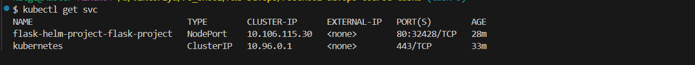
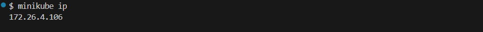
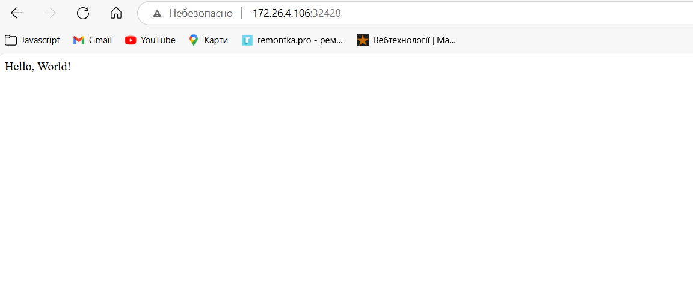
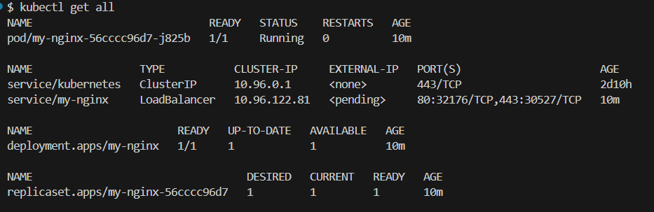
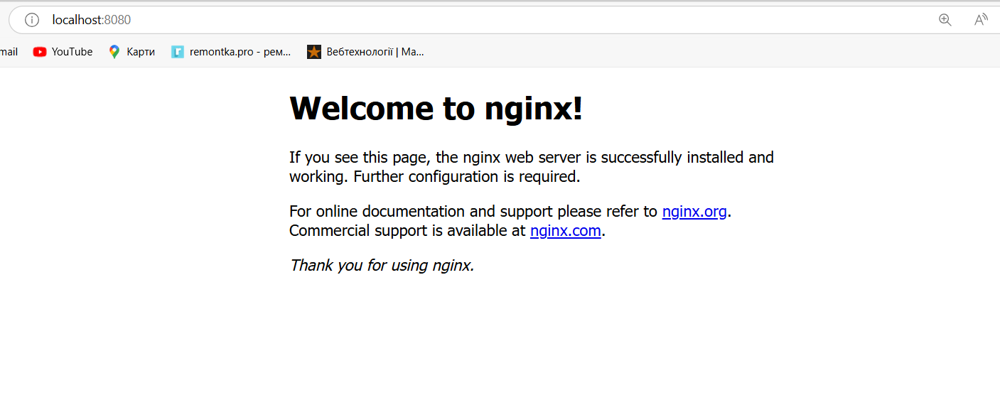
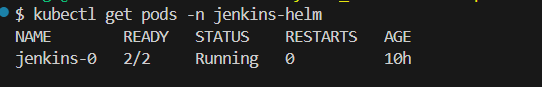
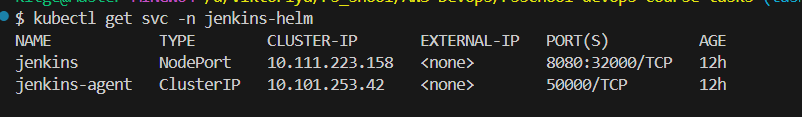
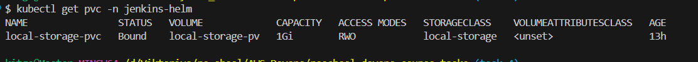

# AWS Infrastructure with Terraform

This repository contains Terraform configuration for a secure AWS infrastructure deployment with GitHub Actions CI/CD pipeline.

## Infrastructure Overview

The infrastructure consists of a VPC with public and private subnets across two availability zones, NAT instance, bastion host, and EC2 instances in both public and private subnets.

```
Terraform >= v1.12.1
```
## Deploy python simple server with Helm

This guide shows how to deploy a simple Python web server in your Kubernetes cluster using **Helm**

```
Docker >=28.0.4
Kubectl >=v1.32.2
Helm >=v3.18.3
Minikube >=v1.36.0
```
1. Minikube should be running:

run it:
```bash
minikube start
```
To check minikube is running:
```bash
kubectl get node
```
Go to helmProject folder and run this commands:

2. Login to the docker:
```bash
docker login
```
Check the server by running the python file ```./helmProject/main.py```

Build the image:
```bash
docker build -t <the image name> .
```
Check the image: and go to http://localhost:80
```bash
docker run -p 80:8080
```
3. Push your image to docker hub by running this commands:
```bash
docker tag <image name> <your docker hub>/<image name>
```

```bash
docker push <your docker hub>/<image name>
```
### Creating deploy

4. Change the image name in ```.helmProject/flask-project/values.yaml```

```yaml
image:
  repository: <your docker hub>/<image name>
```

5. Run the command to create a chart:
!!! Check in which folder you are, should be in helmProject
```bash
helm install <name of chart that you want> flask-project
```
Check the <name of chart that you want> should be deployed
```bash
kubectl get pod
```
7.
```bash
kubectl get svc
```

Take the port in my case is **32428**

8. Run this command to get the minikube address:

```bash
minikube ip
```


9. Go to the http://<minikube ip>:<port of the server in my case **32428**>



## How to Create an NGINX App with Helm

This guide shows how to deploy a simple NGINX web server in your Kubernetes cluster using **Helm** and the official **Bitnami NGINX Helm chart**.

### Prerequisites

- Helm installed and configured
- A running Kubernetes cluster (e.g., Minikube)

###  Steps

#### 1. Add the Bitnami Helm repository

```bash
helm repo add bitnami https://charts.bitnami.com/bitnami
helm repo update
```
#### 2. Install the NGINX Helm chart

```bash
helm install my-nginx bitnami/nginx
```
#### 3. Verify the deployment

```bash
kubectl get all
```


#### 4. Access the NGINX app locally

```bash
kubectl port-forward svc/my-nginx 8080:80
```
#### 5. Then open your browser and go to:

```bash
http://localhost:8080
```


#### To uninstall use this command:

```bash
helm uninstall my-nginx
```

##  Deploy Jenkins with Persistent Storage in Kubernetes Using Helm

This guide explains how to deploy Jenkins on a Kubernetes cluster using Helm, while ensuring configuration and job data are stored persistently using a Persistent Volume (PV) and Persistent Volume Claim (PVC).

### 📁 Files Used

#### `jenkins-pv.yaml`

Defines a static Persistent Volume on the local node:

Open the file and follow the instructions

#### `jenkins-pvc.yaml`

Defines a Persistent Volume Claim that Jenkins will use:

Open the file and follow the instructions

### `jenkins-values.yaml`

Custom Helm values for installing Jenkins with persistent storage and NodePort access:

```yaml
controller:
  adminUser: admin
  adminPassword: admin123 # write your password
  serviceType: NodePort # check
  persistence:
    enabled: true
    existingClaim: local-storage-pvc # write your pvc name
  nodeSelector:
    kubernetes.io/hostname: minikube  # Replace with your node name
```
## Deployment Steps
### 1. Create Namespace
Ensure that you have a path in minikube **/home/storage** for storage cache, if you haven't run this commands:

```bash
minikube ssh
```
```bash
sudo mkdir -p /home/storage
sudo chmod 777 /home/storage
```
**chmod 777** allow jenkins to change the file

```bash
kubectl create namespace jenkins-helm
```
## 2. Apply Persistent Volume and Claim

```bash
kubectl apply -f pv-storage.yml
kubectl apply -f pvc-storage.yml
```
### 3. Add Jenkins Helm Repo
```bash
helm repo add jenkinsci https://charts.jenkins.io
helm repo update
```
### 4. Install Jenkins with Custom Values
```bash
helm install jenkins jenkinsci/jenkins -n jenkins-helm -f jenkins-values.yaml
```
## Verify the Deployment

```bash
kubectl get pods -n jenkins-helm
kubectl get svc -n jenkins-helm
kubectl get pvc -n jenkins-helm
```






### Access Jenkins
Get the Node IP:

```bash
minikube ip
```
Get the NodePort: (default 32000)

```bash
kubectl get svc -n jenkins-helm
```
Open Jenkins in your browser:

```bash
http://<NODE_IP>:<NODE_PORT>
```
### decode from the Kubernetes secret (if createSecret: true was used):

```bash
kubectl get secret jenkins -n jenkins-helm -o jsonpath="{.data.jenkins-admin-password}" | base64 --decode
kubectl get secret jenkins -n jenkins-helm -o jsonpath="{.data.jenkins-admin-user}" | base64 --decode
```

### login and create your first freestyle job:

1. In the Jenkins dashboard, click **“New Item”** from the left menu.

2. **Enter a job name**, e.g., `hello-world-job`.

3. Select **Freestyle project**, then click **OK**.

4. On the job configuration screen:
- Scroll to the **Build** section.
- Click **Add build step → Execute shell**.

5. In the command field, enter:

```bash
echo "Hello world" >> hello.txt
cat hello.txt
```
### if you terminate the pod and then start it again all jobs will be saved!!!

6. Click Save at the bottom.

7. On the project page, click “Build Now”.

8. Click the build number in the Build History (e.g. #1), then click “Console Output” to verify the

## Clean up
```bash
helm uninstall jenkins -n jenkins-helm
kubectl delete pvc local-storage-pvc -n jenkins-helm
kubectl delete pv local-storage-pv
kubectl delete namespace jenkins-helm
```

## Jenkins Security Configuration (via JCasC)

Jenkins is secured using Jenkins Configuration as Code (JCasC) and deployed with Helm. The following security settings are configured automatically:

- **Authentication** is enabled using Jenkins' own user database.
- An admin user is created with the following credentials:
  - **Username**: `admin`
  - **Password**: `auto generated`
- **Authorization strategy**: "Full control once logged in"
- **Anonymous access** is disabled

These settings are defined in the Helm chart’s `jenkins-values.yaml` using the `controller.JCasC.configScripts.security-config` section.

---

## "Hello World" Job Created via JCasC + Job DSL

A freestyle job named `hello-world` is created automatically when Jenkins starts.
### Job Definition

The job is configured to execute a simple shell command:

```bash
echo Hello World
```
#### File `jenkins-values.yaml`
```yaml
enabled: true
    configScripts:
      hello-job: |
        jobs:
          - script: >
              job('hello-world') {
                description('This job was created using Job DSL and JCasC.')
                steps {
                  shell('echo Hello World')
                }
              }
```


## Architecture


### VPC and Network
- **VPC**: 10.0.0.0/16
- **Region**: eu-west-1
- **Availability Zones**: eu-west-1a, eu-west-1b

### Subnet Layout
- **Public Subnets**:
  - 10.0.1.0/24 (eu-west-1a)
  - 10.0.2.0/24 (eu-west-1b)
- **Private Subnets**:
  - 10.0.3.0/24 (eu-west-1a)
  - 10.0.4.0/24 (eu-west-1b)

### Compute Resources
- **Public EC2 Instances**: One per public subnet
- **Private EC2 Instances**: One per private subnet
- **NAT Instance**: Provides outbound internet access for private subnets
- **Bastion Host**: Secure access point to private instances

### Network Components
- **Internet Gateway**: Provides internet access for public subnets
- **Route Tables**:
  - Public route table with internet gateway route
  - Private route table with NAT instance route

### Security
- **Security Groups**:
  - Public instances: Allow HTTP (80), HTTPS (443), and SSH (22)
  - Private instances: Allow SSH only from bastion host, ports to create k3s clusters
  - Nat instance: Allow ports to create cluster and ssh port
- **Network ACLs**: Default NACL configuration

## Bastion Host

The bastion host provides secure SSH access to instances in private subnets.

# K3s Kubernetes Cluster Setup

This repository contains Terraform code and scripts to deploy a lightweight Kubernetes cluster using [K3s](https://k3s.io/) on AWS with a bastion (NAT) host.

## Architecture

- **Master node(s):** Runs the K3s control plane.
- **Worker node(s):** Join the cluster using a shared token.
- **Bastion host (NAT):** Provides secure SSH access to private nodes.
- **Private VPC:** Cluster nodes run on private IPs, accessible via bastion.

## Prerequisites

- AWS account and credentials configured
- Terraform installed
- SSH private key for accessing instances
- `kubectl` installed on your local machine

## Setup Steps

1. **Deploy infrastructure**

   Run Terraform to create VPC, bastion, and EC2 instances:

   in the variable file create three public and private key on your computer:
   1. for nat instance
   2. for public (Bastion) instances
   3. for master and worker node instances

   ```bash
   terraform init
   terraform apply

## Connecting to the Bastion Host

The Bastion Host (also called NAT instance) provides secure access to your private AWS resources, including the Kubernetes master and worker nodes.

### Prerequisites

- SSH private key file (`.pem`) corresponding to the key pair used when launching the Bastion Host.
- Public IP address of the Bastion Host.

### Steps to Connect

1. **Open a terminal on your local machine.**

2. **Run the SSH command:**

```bash
ssh -i /path/to/your/key.pem ubuntu@<BASTION_PUBLIC_IP>
```
### After connection to bastion host it can be public instances or nat:

#### Create private file
```bash
touch private.pem
```

```bash
vi private.pem
```
#### After that pass there your private key for (private instance you want to create) and press ```:wq``` and press Enter

```bash
chmod 400 "private.pem"
```
```bash
ssh -i "private.pem" ubuntu@<Private IP>
```

## Managing the Cluster on the Master Node

After connecting to the master node via the Bastion Host, you can verify and manage your Kubernetes cluster using the following commands:

### 1. Verify Kubernetes nodes

Check the status of all cluster nodes:

```bash
kubectl get nodes
```
View cluster information

```bash
kubectl cluster-info
kubectl get all --all-namespaces
```


## CI/CD Pipeline

GitHub Actions workflow automates the deployment process:

1. **terraform-check**: Validates Terraform code
   - Format check
   - Initialization
   - Validation

2. **terraform-plan**: Creates execution plan
   - Generates plan
   - Comments plan results on pull requests

3. **terraform-apply**: Applies changes
   - Only runs on pushes to main branch
   - Applies infrastructure changes automatically

## State Management

Terraform state is stored in an S3 bucket:
- Bucket: terraform-s3-forbackend
- Key: terraform.tfstate
- Region: eu-west-1

## Authentication

GitHub Actions uses OIDC (OpenID Connect) to authenticate with AWS.

## Usage

1. Clone the repository
2. Configure AWS credentials
3. Set GitHub secrets or replace variables in `.github/workflows/main.yml`
4. Create pull requests for changes
5. Merge to main branch to trigger deployment

