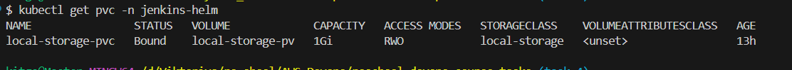

# Task 6: Application Deployment via Jenkins Pipeline


## Objective

configure a Jenkins pipeline to deploy your application on a Kubernetes (K8s) cluster. The pipeline will cover the software lifecycle phases of build, testing, and deployment.


# Step-by-Step guide:

To run this pipeline smoothly, ensure the following tools are installed on the machine(s) executing the pipeline steps (e.g., Jenkins agents or local dev machine):

- **kubectl** — Kubernetes command-line tool to interact with your cluster
- **helm** — Package manager for Kubernetes to install and upgrade charts
- **kaniko executor** — Container image builder that runs inside Kubernetes (used in pipeline via Kaniko container)
- **minikube** (optional) — Local Kubernetes cluster for testing and development
- **curl** — Command-line tool for performing HTTP requests (used in smoke test stage)
- **docker** (optional) — Only if you build images locally outside Kaniko or need to interact with Docker registries manually

# 1. Configure Jenkins with minikube 

```bash
cd helmProject/jenkins-pipeline
```
run below command to create folder for storage pv pvc
```bash
./minikube-storage.sh
```
run to create pv pvc and jenkins file in jenkins-helm namespace:

```bash
./setup-jenkins-pod.sh
```
## Verify the Deployment

```bash
kubectl get pods -n jenkins-helm
kubectl get svc -n jenkins-helm
kubectl get pvc -n jenkins-helm
```





## Access Jenkins
Get the Node IP:

```bash
minikube ip
```
Get the NodePort: (default 32000)

```bash
kubectl get svc -n jenkins-helm
```
Open Jenkins in your browser:

```bash
http://<NODE_IP>:<NODE_PORT>
```
### decode from the Kubernetes secret (if createSecret: true was used):

```bash
kubectl get secret jenkins -n jenkins-helm -o jsonpath="{.data.jenkins-admin-password}" | base64 --decode
kubectl get secret jenkins -n jenkins-helm -o jsonpath="{.data.jenkins-admin-user}" | base64 --decode
```

# 2. Create pipeline:

## Creating a Jenkins Pipeline Job with SCM

Follow these steps to create a Jenkins Pipeline job that loads the pipeline script from your Git repository.


## Steps:

1. Go to your Jenkins dashboard.

2. Click **New Item**.

3. Enter the job name, for example: `jenkins-pipeline`.

4. Select **Pipeline** and click **OK**.

5. Scroll to the **Pipeline** section and choose:

   - **Definition**: Pipeline script from SCM

6. Fill in the SCM details:

   - **SCM**: Git

   - **Repository URL**: `https://github.com/yourusername/yourrepo.git`

   - **Credentials**: (if your repo is private, add credentials)

   - **Branches to build**: `task-6` (or your target branch)

   - **Script Path**: `Jenkinsfile` (or path to your pipeline script)

7. Click **Save**.

---

3. Credentials:

Run this command to create auto do docker:

```bash
kubectl create secret docker-registry regcred \
  --docker-server=https://index.docker.io/v1/ \
  --docker-username=<your-docker-username> \
  --docker-password=<your-docker-password> \
  --docker-email=<your-email>
```

you need to create 3 credentials:
Go to Dashboard => Manage Jenkins => Credentials:

create creds with the same id and type


## How to Get Tokens and Configure kubectl

This guide explains how to obtain access tokens for Docker Hub and Slack, and how to configure `kubectl` for Kubernetes access.

---

## 1. Get Docker Hub Access Token

1. Log in to [Docker Hub](https://hub.docker.com/).

2. Click your profile icon (top right) → **Account Settings**.

3. Go to **Security** → **New Access Token**.

4. Give your token a name (e.g., `Jenkins`), then click **Generate**.

5. Copy the generated token immediately — you won't see it again.

6. Use this token for authenticating Docker CLI or in CI/CD pipelines.

7. Paste to your docker credential

---

## 2. Get Slack Token (for Slack Apps and Bots)

1. Go to [Slack API: Your Apps](https://api.slack.com/apps).

2. Click **Create New App** → choose "From scratch".

3. Enter an app name and select your workspace.

4. Under **OAuth & Permissions**, add required scopes (e.g., `chat:write`).

5. Click **Install to Workspace** and authorize.

6. Copy the **Bot User OAuth Token** starting with `xoxb-...`.

7. Use this token in your Jenkins or other CI/CD tools for sending Slack messages.

8. Paste to slack token credential

---

## 3. Configure kubectl

### a Install kubectl

Follow instructions from the official doc:
https://kubernetes.io/docs/tasks/tools/install-kubectl/

### b Set up kubeconfig

- Obtain your cluster's kubeconfig file (usually provided by your cloud provider or cluster admin).

- Save the config file to:

  ```bash
  ~/.kube/config
  ```

copy the config file

Paste to kubectl credential

---

# 4. Plugins:

Go to Dashboard => Manage Jenkins => Plugins:

Insure that all of the plugins installed:

- Blue Ocean
- Configuration as Code Plugin
- Docker Pipeline
- GitHub Integration Plugin
- Job DSL
- Kubernetes plugin
- Pipeline
- Pipeline: GitHub
- Pipeline: Stage View Plugin
- Slack Notification Plugin
- SSH Build Agents plugin
- SonarQube Scanner for Jenkins

**Restart Jenkins after installation**

# 5. Jenkinsfile

```yaml
environment {
        REGISTRY = "docker.io" # registry
        RELEASE = "1.0.${BUILD_NUMBER}" # build number from jenkins job
        APP_NAME = "python-app" # the folder in root where my python project with test, code, and dockerfile
        PATH_TO_HELM_PROJECT = "./helmProject/flask-project" # helm folder for deploy the python image
        NAMESPACE = "flask-helm" # namespace where services pod and will be deployed
        HELM_FOLDER = "flask-project" # name of project for helm deploy
        SLACK_WEBHOOK = credentials('slack-jenkins') #slack token which we create in credential the id from jenkins must be the same as 'slack-jenkins'
      }
```

- The pipeline includes the following steps:
     - Application build
     - Unit test execution
     - Security check with SonarQube
     - Docker image building and pushing to ECR (manual trigger)
     - Deployment to K8s cluster with Helm (dependent on the previous step)
     - Smoke test

# 6. Sonarqube 
uncommit the sonarqube code

1. Login on SonarClound
2. Create the token

3. Go to Dashboard => Manage Jenkins => configure

4. Find Sonarqube Scanner:
5. Add server paste the SonarCould link
6. Check Environment variables
## 🔐 1. Add SonarQube Token to Jenkins Credentials

1. Go to **Jenkins Dashboard → Manage Jenkins → Credentials**.
2. Choose a domain (or use `(global)`).
3. Click **Add Credentials**.
4. Select:
   - **Kind**: *Secret Text*
   - **Secret**: your SonarQube token (from [SonarQube → My Account → Security → Generate Token](https://your-sonarqube-instance/account/security))
   - **ID**: `SONAR_TOKEN` (or any ID you like)
   - **Description**: SonarQube Token for sonar-scanner
5. Click **OK**.
---
6. The name of sever must be the same as in Jenkinsfile **sonar_qube**
7. Chose the credential sonar-scanner
8. Click **OK**.

# 7. Push the changes
- commit and push the changes to your branch

- Go to the jenkins, choose the job and press build


- In docker hub the image created


- Slack message generated


- Run command to insure that the python pod is working correctly

```bash
kubectl get pod -n flask-helm
```


- Click in slack to **Click here to view the build the app should be opened


# 8. Create github Webhook

### Prerequisites
Jenkins is accessible at http://<minikube.ip>:32000

You have ngrok installed: https://ngrok.com/download

Jenkins is configured to allow GitHub webhooks

You already have a Jenkins pipeline job created

### Step-by-Step Instructions
1. Expose Jenkins to GitHub using ngrok
Run this command from your terminal:

```bash
ngrok http <minikube.ip>:32000
```
It will show something like:

```bash
Forwarding https://abc123.ngrok.io -> http://12.12.13.0:32000
```
2. Copy the https://abc123.ngrok.io URL.

3. Configure GitHub Webhook
In your GitHub repo:

Go to Settings → Webhooks → Add webhook

Fill in:

Payload URL:
!!! **important add /github-webhook/ in the link**
```bash
https://abc123.ngrok.io/github-webhook/
```
Content type:
application/json
Secret: (leave empty for now — optional)
Events:
✅ Just the push event

Click Add Webhook
### Update Jenkins Job Settings
1. In your Jenkins pipeline job:

Go to Configure

2. Under Build Triggers, check:

✅ GitHub hook trigger for GITScm polling

Under Pipeline / Source Code Management, make sure you:

- Use Git

- Provide the GitHub repo URL

In Branches to build, put:

task-6


### Install Jenkins Plugins (if not yet)
✅ GitHub

✅ GitHub Integration

✅ GitHub Branch Source

⑤Test the Webhook
Make a commit to your task-6 branch and push it.

GitHub will send a payload to the ngrok URL → Jenkins will trigger the job.

You can verify:

In GitHub under Webhooks → Recent Deliveries

In Jenkins, check if the pipeline was triggered


